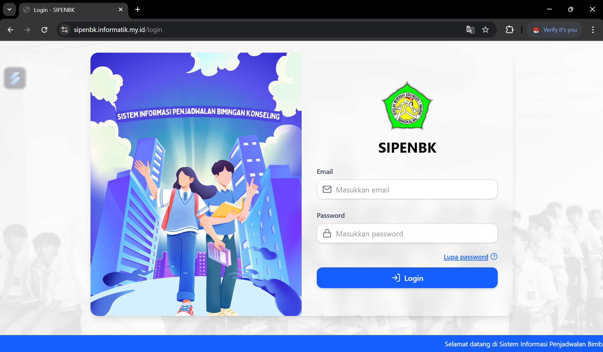
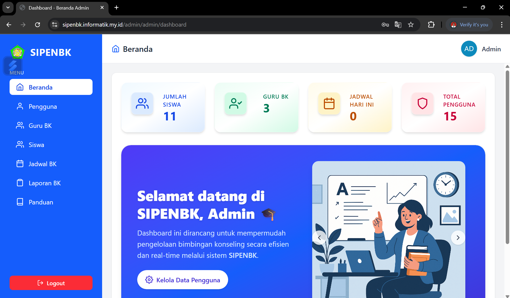
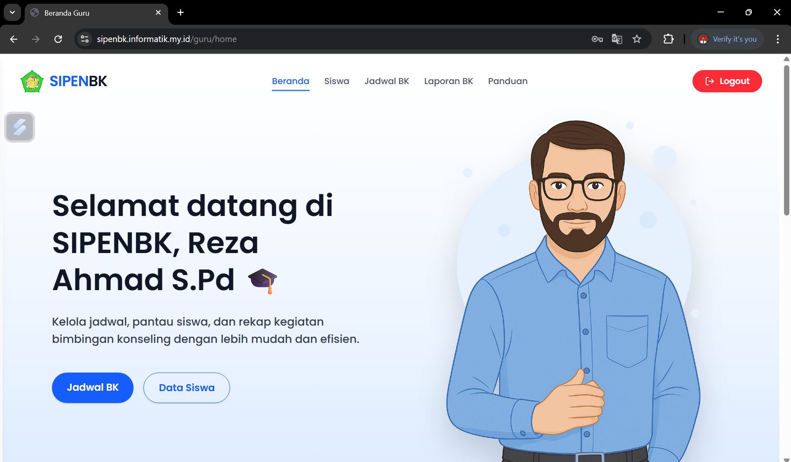
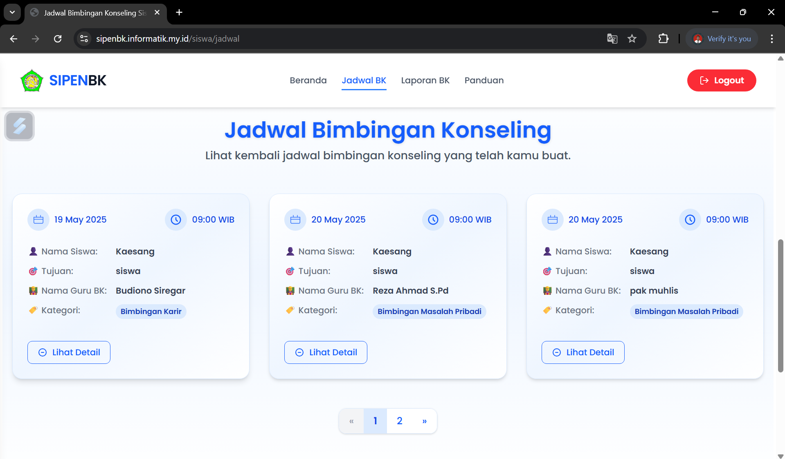
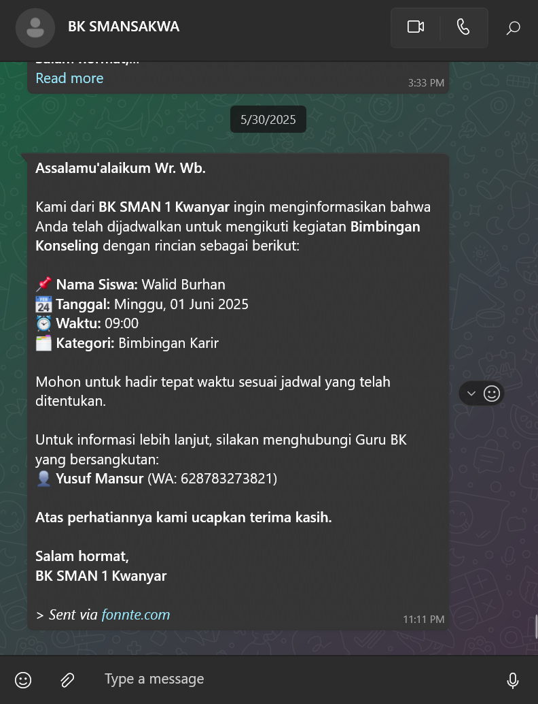

# SIPENBK (Sistem Informasi Penjadwalan BK)

SIPENBK adalah sistem penjadwalan bimbingan konseling berbasis web yang digunakan di SMAN 1 Kwanyar. Sistem ini dirancang dengan tampilan modern dan dilengkapi manajemen role, laporan BK, dan notifikasi WhatsApp otomatis melalui Fonnte API. Dibangun menggunakan Laravel 12 dan Tailwind CSS. Link public web https://sipenbk.informatik.my.id/ 

---

## 🚀 Fitur Utama

SIPENBK memiliki fitur yang berbeda sesuai peran (role) pengguna: **Admin**, **Guru BK**, dan **Siswa**.

<p align="center">
  
</p>

<p align="center">
  
</p>

---

## 🖼️ Screenshot Lainnya

<p align="center">
  
  
  
  
</p>

---

## 👑 Admin

Admin memiliki akses penuh untuk mengelola seluruh data dalam sistem:

### **Manajemen Data**
- Mengelola user (admin, guru BK, siswa)
- Mengatur hak akses / role
- Mengelola data guru BK
- Mengelola data siswa
- Mengelola panduan sistem

### **Dashboard**
- Statistik jumlah siswa, guru BK, jadwal, laporan

### **Jadwal BK**
- Membuat, mengedit, dan menghapus semua jadwal
- Notifikasi otomatis via WhatsApp

### **Laporan BK**
- Melihat, mengedit, dan menghapus laporan BK

---

## 👨‍🏫 Guru BK

Guru BK memiliki fitur khusus untuk melayani kebutuhan konseling siswa:

### **Menu Siswa**
- Mengelola data siswa di dalam sistem

### **Jadwal BK**
- Membuat jadwal dengan siswa
- Mengelola jadwal pribadi
- Mendapatkan notifikasi WhatsApp ketika:
  - Jadwal baru dibuat
  - Siswa mengajukan jadwal
- Mengirim notifikasi ke orang tua ketika diperlukan (pemanggilan)

### **Laporan BK**
- Membuat laporan hasil bimbingan
- Mengedit dan melihat riwayat laporan

### **Panduan**
- Mengakses informasi cara penggunaan sistem

### **Profil**
- Mengubah foto profil

---

## 🎓 Siswa

Siswa mendapatkan akses sesuai kebutuhan individu:

### **Jadwal BK**
- Membuat jadwal dengan guru BK
- Mendapatkan notifikasi WhatsApp setelah membuat jadwal
- Guru BK juga mendapat notifikasi

### **Laporan BK**
- Melihat laporan dari guru BK

### **Panduan**
- Melihat cara penggunaan sistem

### **Profil**
- Mengganti foto profil

---

## 📩 Alur Notifikasi WhatsApp

Notifikasi dilakukan menggunakan **Fonnte API**:

- Siswa → buat jadwal → **Siswa dan Guru BK menerima notif**
- Guru BK → buat jadwal → **Guru BK dan Siswa menerima notif**
- Guru BK → jadwalkan pemanggilan → **Orang tua dan siswa menerima notif**

---

## 🛠️ Teknologi yang Digunakan

- **Laravel 12** (Backend)
- **Tailwind CSS** (Styling modern)
- **Alpine.js** (Interaksi UI ringan)
- **JavaScript** (Dynamic UI)
- **HTML** (Structure)
- **Fonnte API** (Notifikasi WhatsApp otomatis)
- **MySQL** (Database)

---

<!-- ## 🧩 Instalasi

```bash
git clone https://github.com/Hamdani-10/SIPENBK.git
cd SIPENBK

composer install
npm install
npm run build

cp .env.example .env
php artisan key:generate

# Atur konfigurasi database lalu:
php artisan migrate --seed

php artisan serve -->

<<<<<<< 
<p align="center"><a href="https://laravel.com" target="_blank"></a></p>

<p align="center">
<a href="https://github.com/laravel/framework/actions"></a>
<a href="https://packagist.org/packages/laravel/framework"></a>
<a href="https://packagist.org/packages/laravel/framework"></a>
<a href="https://packagist.org/packages/laravel/framework"></a>
</p>

## About Laravel

Laravel is a web application framework with expressive, elegant syntax. We believe development must be an enjoyable and creative experience to be truly fulfilling. Laravel takes the pain out of development by easing common tasks used in many web projects, such as:

- [Simple, fast routing engine](https://laravel.com/docs/routing).
- [Powerful dependency injection container](https://laravel.com/docs/container).
- Multiple back-ends for [session](https://laravel.com/docs/session) and [cache](https://laravel.com/docs/cache) storage.
- Expressive, intuitive [database ORM](https://laravel.com/docs/eloquent).
- Database agnostic [schema migrations](https://laravel.com/docs/migrations).
- [Robust background job processing](https://laravel.com/docs/queues).
- [Real-time event broadcasting](https://laravel.com/docs/broadcasting).

Laravel is accessible, powerful, and provides tools required for large, robust applications.

## Learning Laravel

Laravel has the most extensive and thorough [documentation](https://laravel.com/docs) and video tutorial library of all modern web application frameworks, making it a breeze to get started with the framework.

You may also try the [Laravel Bootcamp](https://bootcamp.laravel.com), where you will be guided through building a modern Laravel application from scratch.

If you don't feel like reading, [Laracasts](https://laracasts.com) can help. Laracasts contains thousands of video tutorials on a range of topics including Laravel, modern PHP, unit testing, and JavaScript. Boost your skills by digging into our comprehensive video library.

## Laravel Sponsors

We would like to extend our thanks to the following sponsors for funding Laravel development. If you are interested in becoming a sponsor, please visit the [Laravel Partners program](https://partners.laravel.com).

### Premium Partners

- **[Vehikl](https://vehikl.com/)**
- **[Tighten Co.](https://tighten.co)**
- **[WebReinvent](https://webreinvent.com/)**
- **[Kirschbaum Development Group](https://kirschbaumdevelopment.com)**
- **[64 Robots](https://64robots.com)**
- **[Curotec](https://www.curotec.com/services/technologies/laravel/)**
- **[Cyber-Duck](https://cyber-duck.co.uk)**
- **[DevSquad](https://devsquad.com/hire-laravel-developers)**
- **[Jump24](https://jump24.co.uk)**
- **[Redberry](https://redberry.international/laravel/)**
- **[Active Logic](https://activelogic.com)**
- **[byte5](https://byte5.de)**
- **[OP.GG](https://op.gg)**

## Contributing

Thank you for considering contributing to the Laravel framework! The contribution guide can be found in the [Laravel documentation](https://laravel.com/docs/contributions).

## Code of Conduct

In order to ensure that the Laravel community is welcoming to all, please review and abide by the [Code of Conduct](https://laravel.com/docs/contributions#code-of-conduct).

## Security Vulnerabilities

If you discover a security vulnerability within Laravel, please send an e-mail to Taylor Otwell via [taylor@laravel.com](mailto:taylor@laravel.com). All security vulnerabilities will be promptly addressed.

## License

The Laravel framework is open-sourced software licensed under the [MIT license](https://opensource.org/licenses/MIT).
=======
# SIPENBK
A web based counseling scheduling system for SMAN 1 Kwanyar, featuring role based access, student &amp; counselor management, and WhatsApp notifications via Fonnte API. Built with Laravel and a modern Tailwind UI
>>>>>>> f04bae6c7e98d82bf0ee7029edac83713793fc59
